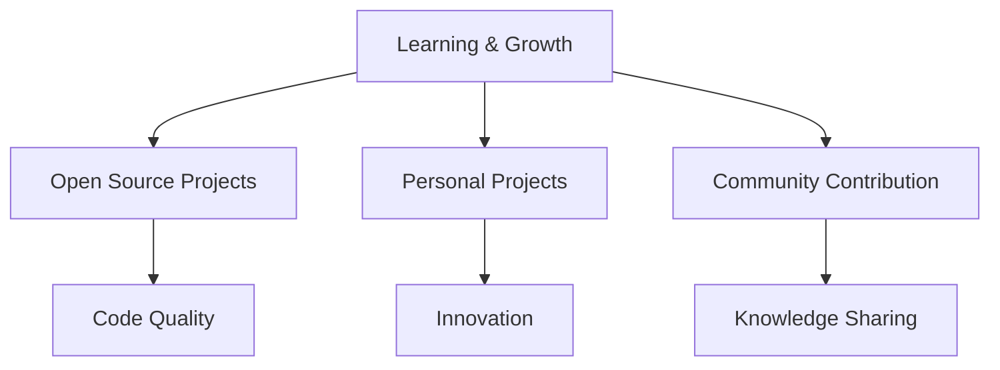

<div align="center">


#  Pygrammerik

### 

[](https://github.com/Pygrammerik)
[](https://github.com/Pygrammerik)
[](https://github.com/Pygrammerik)

---

</div>

## About Me

```python
class Pygrammerik:
    def __init__(self):
        self.name = "Pygrammerik"
        self.role = "Python Developer"
        self.passion = "Creating amazing projects"
        self.location = "Digital Space"
        
    def code(self):
        return "Building the future, one line at a time"
        
    def learn(self):
        return "Always exploring new technologies"
```

## Tech Stack

<div align="center">

| Language | Proficiency | Experience |
|----------|-------------|------------|
| **Python** | ⭐⭐⭐⭐⭐ | 3+ years |
| **Web Development** | ⭐⭐⭐⭐ | 2+ years |
| **Data Science** | ⭐⭐⭐ | 1+ years |
| **Automation** | ⭐⭐⭐⭐ | 2+ years |

</div>

## Current Focus



## Currently Learning

<div align="center">


</div>

## Achievements & Certifications

<div align="center">


</div>

## GitHub Statistics

<div align="center">


</div>

## Featured Projects

<div align="center">

### RLIB
*Конвертер и лаунчер .rpkg файлов*

[](https://github.com/Pygrammerik/RLIB)
[](https://github.com/Pygrammerik/RLIB/releases)

### KalOS
*Операционная система без пакетов, только консоль*

[](https://github.com/Pygrammerik/KalOS)
[](https://github.com/Pygrammerik/KalOS/releases)


</div>

## Recent Activity

```text
Last 7 days activity:
████████████████████████████████████████ 100% (7/7 days)
```

## Weekly Development Breakdown

```text
Python Projects:    ████████████████████████████████████ 40%
Web Development:    ████████████████████████████         30%
Data Analysis:      ████████████████                     20%
Documentation:      ████████                             10%
```

## Fun Facts

<div align="center">


</div>

## Coding Activity

```text
Python Development Timeline:
████████████████████████████████████████ 100%
Web Development Progress:
████████████████████████████████████   90%
Data Science Journey:
████████████████████████████           70%
Automation Projects:
████████████████████████████████████   85%
```

## Skills & Tools

<div align="center">

### Languages


### Frameworks & Libraries


### Tools & Technologies


### Databases & Cloud


### Interests & Hobbies


</div>

## Development Philosophy

```python
def development_approach():
    principles = {
        "code_quality": "Write clean, readable, maintainable code",
        "documentation": "Document everything for future self",
        "testing": "Test early, test often, test everything",
        "learning": "Never stop learning and improving",
        "collaboration": "Share knowledge and help others grow"
    }
    return principles
```


## Blog & Content

<div align="center">

[](http://blog.pygrammer.ru/)
[](https://t.me/pygrammerik)
[](https://www.youtube.com/@Pygrammerik)

</div>

## Contact & Collaboration

<div align="center">

[](https://github.com/Pygrammerik)
[](https://t.me/pygrammerik)
[](https://www.youtube.com/@Pygrammerik)

</div>

---

<div align="center">


**Thanks for visiting my profile!**

</div>
